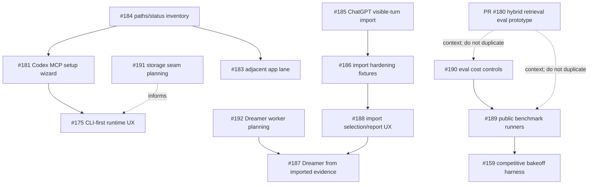

# Tranche coordination: issues #159, #175, #181, #183, #184, #185–#192

Status: root coordination plan plus first-wave design notes. This document is intentionally conservative: it sequences work so current SQLite behavior remains the default, `rusqlite` stays in place, CI stays local/external-service-free, model/provider paths are opt-in, Dreamer apply remains explicit, and recall remains background context rather than authority.

## Root dependency map

### Parallel first wave

These work items can run in parallel because they are mostly design/planning and have disjoint write surfaces:

| Thread | Issues | First-wave goal | Primary files | Tests/checks |
| --- | --- | --- | --- | --- |
| A — Storage foundation | #191 | Design SQLite/libSQL seam and identify abstraction blockers; optional compile-only POC later | `docs/storage-libsql-plan.md`, later `src/store.rs` only after design review | `cargo fmt --check`; no storage behavior tests unless code changes |
| B — Runtime/product UX | #184, then #181 | Inventory paths/status and plan reversible Codex MCP setup; lowest-risk implementation should be status/paths before config mutation | `docs/runtime-ux-plan.md`, later `src/cli.rs`, `src/native_runtime.rs`, `src/status.rs`, adapter templates/tests | CLI temp-dir tests once code lands |
| C — Dreamer worker | #192 | Plan worker lifecycle and cost modes only | `docs/dreamer-worker-plan.md`, `docs/dreamer-loop-design.md` references | `cargo fmt --check`; no runtime tests for design-only |
| E — Eval ops | #190 | Design cheap subset/cost/cache controls around existing deterministic retrieval eval and PR #180 hybrid prototype | `docs/eval-benchmark-ops-plan.md`, `docs/eval-substrate.md` references | `cargo fmt --check`; eval tests after CLI flags land |

### Must wait / second wave

- #185 and #186 should wait until the importer design is reviewed because ChatGPT archive parsing touches policy, evidence ledger, `/v1/turns`, CLI UX, fixtures, and idempotency.
- #187 must wait for #185/#186 and should also consume #192’s worker-mode plan so imported evidence can feed existing preview/apply without hidden model calls or auto-apply.
- #188 should land after the importer parser/manifest shape is known; it can follow #186 or be grouped with it if the first importer PR is still small.
- #189 should wait for #190’s subset/cost/report contract and use PR #180 only as retrieval-eval context, not as a public-benchmark implementation.
- #159 should wait for #189’s neutral benchmark format and provider-adapter contract so bakeoff adapters are optional and CI skips external systems.
- #175 broader runtime closure should wait for #184/#181 and any storage seam implications from #191.
- #183 should wait for #184’s inventory vocabulary so adjacent app endpoints are reported separately and remain disabled by default.

### Design-only first

- #191 is design-only first because `src/store.rs` is a concrete SQLite store with migrations, FTS, backup, search, and schema-version behavior coupled to `rusqlite`.
- #192 is design-only first because worker lifecycle, status, and cost modes must be specified before any daemon/worker scheduling code runs.
- #190 is design-first because public evals and bakeoffs must not accidentally introduce hidden paid calls or full-dataset defaults.
- #185/#186 need parser/preview/apply and privacy/idempotency design before implementation; synthetic fixtures only.
- #183 needs design first because an adjacent app lane can create endpoint ownership and lifecycle ambiguity.

### File-overlap risks

| Area | Risky files | Threads that may touch them | Sequencing rule |
| --- | --- | --- | --- |
| CLI command tree | `src/cli.rs` | B, C, D, E | Do not implement multiple CLI-heavy threads in parallel; land one command family at a time. |
| Status response | `src/status.rs`, `src/protocol.rs`, `tests/contract_snapshots.rs` | B, C, D, #183 | Add additive JSON fields carefully and update snapshots once per PR. |
| Store abstraction | `src/store.rs`, migrations, backup tests | A, D, Dreamer/eval follow-ups | Keep #191 design separate from importer/eval writes; no storage behavior changes in first wave. |
| Dreamer evidence | `src/dream.rs`, `src/service.rs`, `tests/dreamer.rs` | C, D187 | Plan worker first; implement imported evidence integration after importer foundation. |
| Eval fixtures/reports | `src/retrieval_eval.rs`, `src/hybrid_retrieval.rs`, `tests/fixtures/retrieval/*`, `tests/cli_smoke.rs` | E189/E190, #159 | Land cost/subset controls before public runners/adapters. Avoid changing PR #180 hybrid semantics. |
| MCP/Codex adapter | `src/mcp.rs`, `adapters/codex-mcp/*`, `docs/dogfood-mcp.md` | B181, #175 | Wizard should own only a bounded config block and preserve unrelated config. |

## PR grouping recommendation

### Group into one PR

- #185 + #186 can be one importer-foundation PR if kept to parser, preview/apply, synthetic fixtures, policy gates, and idempotency. If it grows, split #185 parser/preview/apply first and #186 hardening immediately after.
- #189 + the already-designed pieces of #190 can be one PR only if #190’s controls are implemented first and the public runner supports a tiny synthetic fixture with no external services.

### Keep as separate PRs

- #191 should be its own design PR because it informs later runtime/storage work and must not destabilize recall.
- #184 should be separate from #181 if #181 mutates Codex config; inventory/status is safer and useful independently.
- #181 should be separate because backup/idempotent config mutation needs focused review and temp-file tests.
- #192 should be separate because it establishes no-hidden-cost worker contracts.
- #187 should be separate from importer foundation because it changes Dreamer evidence and candidate behavior.
- #188 should be separate unless it is purely manifest/report polish; selection UX can balloon.
- #159 should remain separate because external-system adapters are optional, credential-gated, and higher review risk.
- #175 should close as a later aggregation PR after status/paths, MCP setup, and any managed-container polish settle.
- #183 should be separate because adjacent app endpoint ownership must not blur normal daemon lifecycle semantics.

## First-wave thread briefs

### Thread A — #191 storage foundation

Bounded output for the first PR:

- Add a design note comparing current SQLite, libSQL local, libSQL sync/self-hosted, and libSQL remote/Turso-style modes.
- Define a minimal storage seam around domain operations rather than raw SQL where possible.
- Inventory blockers: migrations, FTS5/search fallback, backup/restore, transactions, schema versioning, JSON metadata, evidence ledger writes, Dreamer audit rows, and future vector/sync behavior.
- Do not change production recall behavior, migrations, or default storage config.
- Optional POC only behind a feature flag and only if it compiles without cloud setup.

Recommended tests: `cargo fmt --check`; full store tests only once code changes begin.

### Thread B — #184/#181 runtime/product UX

Dependency plan:

1. Land `codex-memoryd paths` or a `status --paths`/inventory-compatible JSON shape that lists config, DB, PID, log, runtime env, backups, exports, and which are durable vs ephemeral.
2. Add status wording for durable vs ephemeral state without changing `/v1/status` contract unless snapshots are updated deliberately.
3. Implement Codex MCP setup wizard as a separate command family with `preview`, `apply`, `status`, and `remove`.
4. Make every config mutation bounded to an owned `codex-memoryd` block, backed up before write, idempotent, and reversible.
5. Use temp-file CLI tests for create/update/idempotency/remove/preserve-unrelated-config.

Non-overlap rule: avoid `src/store.rs`; runtime UX should consume existing config/runtime paths and service status.

### Thread C — #192 Dreamer worker planning

Worker-mode contract:

- `deterministic` mode is the default: free, bounded, no model calls, uses existing Dreamer preview/apply paths.
- `local-model` mode is opt-in and must report model path, download state, and estimated local resources; no required download.
- `provider` mode is opt-in and must show configured provider/model and paid-call readiness in status; no provider call in CI.
- Worker output is only a patch/dream preview artifact until the user explicitly applies it.
- Status must show enabled/disabled, current mode, last run, next eligible run, and whether any paid provider is configured.

Non-overlap rule: do not implement provider calls or auto-apply in this tranche.

### Thread D — #185/#186/#187/#188 ChatGPT export import

Foundation dependencies:

- Understand `/v1/turns`, visible turns, source ledger entries, content policy, evidence windows, and patch preview/apply before coding.
- Importer writes visible-turn evidence only; it does not create durable memories directly.
- Synthetic fixtures only; no real ChatGPT user exports.
- Stable source conversation IDs + turn indices become idempotency keys.
- Preview writes nothing and never logs raw content on parse errors.
- Large archives require filters or explicit `--all`; manifests should feed status/paths inventory.

Recommended grouping: parser/preview/apply + hardening first (#185/#186), selection/report UX second (#188), Dreamer imported-evidence behavior third (#187).

### Thread E — #159/#189/#190 evals and bakeoff

First-wave contract:

- Start with #190: subset/limit/dry-run/cache/report design and local no-LLM retrieval scoring.
- Keep PR #180’s `hybrid_sparse_fusion` as an eval-only experiment and do not duplicate or promote it to production recall.
- Define a neutral benchmark input format before adding LoCoMo/LongMemEval/BEAM adapters.
- CI uses tiny synthetic fixtures only.
- Full public benchmark runs require explicit flags and checked local dataset paths.
- Provider/bakeoff adapters are skipped unless explicitly configured; reports include latency, estimated tokens/cost, errors, and caveats.

## Unlock order

1. First PR: this coordination/design plan plus any standalone design docs for #191/#192/#190/#184.
2. #184 inventory implementation unlocks #181 and later #175/#183.
3. #190 implementation unlocks #189 public runners and then #159 bakeoff adapters.
4. #185/#186 importer foundation unlocks #188 selection/report UX and #187 Dreamer integration.
5. #191 reviewed seam unlocks safe libSQL experiments without changing default SQLite behavior.
